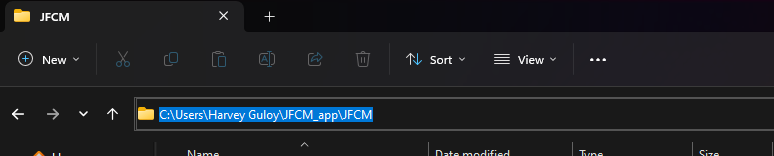
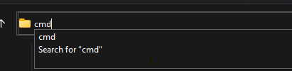

# JFCM App
## Purpose
Our main goal is to spread the word of God using this app. Nowadays, people tend to use their mobiles more than they use other gadgets because of convenience. With an app, our security is much better compared to having it on a website.

## Stakeholder Analysis
- Youth
- Unbelievers
- Pastors and elders
- Church members old gen
- Church members Youth and young ads(12-30yrs)
- Community churches
- Christian Schools
- Legalities
- New member local church

|     **High Impact and Low Interest**     	|                                    **High Impact and High Interest**                                   	|
|:----------------------------------------:	|:------------------------------------------------------------------------------------------------------:	|
| - Legalities                          	| - Church members old gen  - Pastors and elders    - Church members Youth and young ads(12-30yrs) 	|
|      **Low Impact and Low Interest**     	|                                    **Low Impact and High Interest**                                    	|
| - Unbelievers   - Community churches  	| - Unbelievers   - Christian Schools                                                                 	|

# Features
- Homepage
- Daily devotion
    - Comment section
    - Questions to ask like
	    - What is God telling you today?
	    - What did you understand from the passage?
	    - How can you apply this today?
- Resources
- Prayer Request
- Project Ezra

## Requirements
- [ ] Java Knowledge
- [ ] Android Developer Knowledge
- [ ] Design from Hannah
- [ ] Download Git to your computer
	- Make sure to SELECT git to add PATH otherwise, this will not work
	- https://git-scm.com/downloads

## Other Important stuff
>To clone this repository to your local computer.
>1. Choose a Folder
>2. Click on the Folder's path like this  
>3. Then type cmd and hit enter  
>4. Type this in your command prompt `git clone https://github.com/harveyguloy/JFCM.git`

> **Download**  
> Git: https://git-scm.com/downloads  
> Android Studio: https://developer.android.com/
### Git Commands
>To PUSH use this method  
> `git add .`  
>`git commit -m "Explain what you changed"`  
> `git push` 
